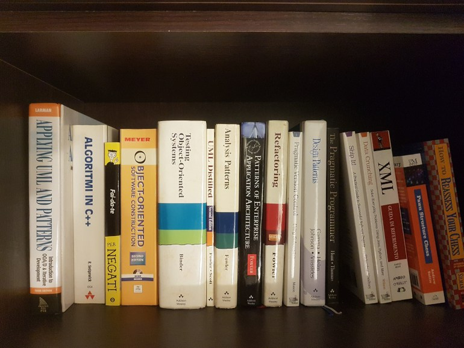

 

<h1 align="center">  Programming </h1>

	

This directory is split it into two:

- [BY PROGRAMMING LANGUAGE](./language/README.md)
	- _Books that cover a specific programming language_

- [BY DOMAIN](./domain/README.md)
	- _Books that cover a programming-related domain in a programming-language agnostic way_
